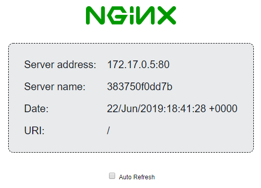

# Azure Kubernetes Service (AKS) Examples

Code examples for **Azure Kubernetes Service (AKS)**.  
Each sub-folder contains the required scripts and YAML config files to deploy and configure Kubernetes.

## /aks-nginx-demo

`setup-aks-nginx-demo.ps1` uses **Azure CLI** commands to create an Azure Kubernetes Cluster, and apply an nginx demo
deployment.

The following steps are automated:

- Creates a Resource Group
- Creates an AKS cluster
- Applies the nginx deployment defined in `nginxdemo.yml`
- Creates a ClusterRoleBinding to access the Kubernetes dashboard
- Opens the Kubernetes dashboard in your default browser

### Screenshot

Once the nginx deployment has been applied, the following page will be shown on port `http://<node-ip-address>:8080`  

This info shows loadbalancing at work when deployed on multiple nodes.
